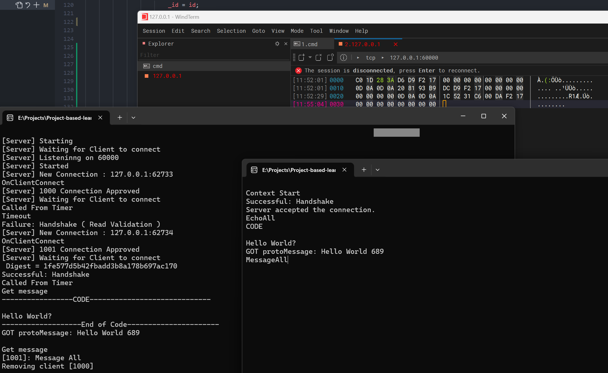

## Dependencies

1. [asio](https://think-async.com/Asio/)
2. [protobuf-27.3](https://github.com/protocolbuffers/protobuf)


## Setup

```
E:.
├─build
├─dist
├─libs
│  ├─sio-1.30.2
│  └─protobuf-27.3-g++
└─modules
    ├─net-client
    ├─net-common
    ├─net-server
    ├─protobuf-types
    └─simple-example
```

1. create `libs` which contain asio 
2. create `dist` folder for having the output file
3. use cmake build


