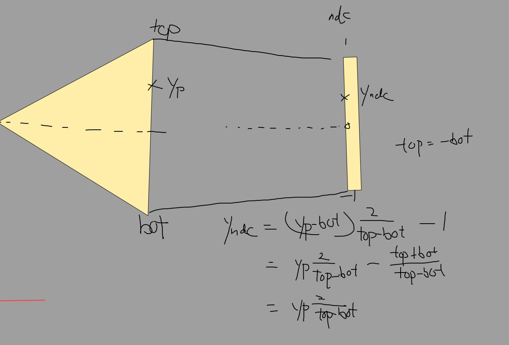
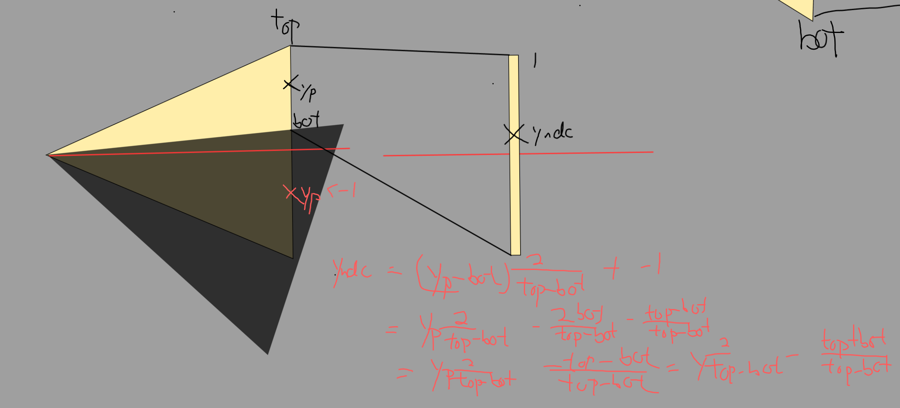

## Compile
```mingw32-make```


## Remark

### Line5($x_0$, $y_0$, $x_1$, $y_1$, Color)
 


### Barycentric-coordinates
```math
\begin{align}
    px = w_A * ax + w_B * bx + w_C * cx \\
    py = w_A * ay + w_B * by + w_C * cy \\
    1  = w_A + w_B + w_C\\
\end{align}
```

```math
\begin{pmatrix}
p_x \\
p_y \\
1
\end{pmatrix}
=
\begin{pmatrix}
a_x & b_x & c_x \\
a_y & b_y & c_y \\
1 & 1 & 1
\end{pmatrix}
\begin{pmatrix}
w_A \\
w_B \\
w_C
\end{pmatrix}
```

### Projection matrix

```math
\frac{d}{z}
\begin{pmatrix}
1 & 0   & 0   & 0\\
0   & 1 & 0   & 0\\
0   & 0   & 1 & 0\\
0   & 0   & \frac{z}{d}   & 0
\end{pmatrix}
\begin{pmatrix}
x\\
y\\
z\\
z/d  
\end{pmatrix}
=\begin{pmatrix}
x\times\frac{d}{z}\\
y\times\frac{d}{z}\\
z\times\frac{d}{z}\\
1 
\end{pmatrix}
=\begin{pmatrix}
x_p\\
y_P\\
z_P\\
1
\end{pmatrix}
```
### Convert to normalized device coordinates ( NDC )
```math
\begin{align}
y_{ndc} &= (y_p-\text{bot})\times\frac{2}{\text{top}-\text{bot}}+-1\\
y_{ndc} &= \frac{2\times{y_p}}{\text{top}-\text{bot}}-\frac{2\times{\text{bot}}}{\text{top}-\text{bot}}- \frac{\text{top}-\text{bot}}{\text{top}-\text{bot}}\\
y_{ndc} &=\frac{2\times{y_p}}{\text{top}-\text{bot}}- \frac{2\times\text{bot}+\text{top}-\text{bot}}{\text{top}-\text{bot}}\\
y_{ndc} &=\frac{2\times{y_p}}{\text{top}-\text{bot}}- \frac{\text{top}+\text{bot}}{\text{top}-\text{bot}}\\
\end{align}
```

The view point is in center and symmetric

```math
\begin{align}
y_{ndc} &= y_p\times\frac{2}{\text{top}-\text{bot}} +0 \\
\end{align}
```
The view point is not in center and not symmetric e.g $(\text{top length} \not = \text{bottom length})$

```math
\begin{align}
y_{ndc} &=\frac{2\times{y_p}}{\text{top}-\text{bot}}- \frac{\text{top}+\text{bot}}{\text{top}-\text{bot}}\\
\end{align}
```

Replace $y_p$ with $\frac{y_\text{cam} \times -\text{near}}{z_\text{cam}}$ where $z_\text{cam}$ <0

```math
\begin{split}
y_{ndc} &=\frac{2\times \frac{y_\text{cam}\times -\text{near}}{z_\text{cam}}}{\text{top}-\text{bot}}- \frac{\text{top}+\text{bot}}{\text{top}-\text{bot}}\\
y_{ndc} &=\frac{2\times y_\text{cam} \times \text{near}}{-z_\text{cam} \times (\text{top}-\text{bot})}- \frac{\text{top}+\text{bot}}{\text{top}-\text{bot}}\\
y_{ndc} &=\frac{\frac{2\times y_\text{cam}}{ \text{top}-\text{bot}}\times \text{near}}{-z_\text{cam} }- \frac{\text{top}+\text{bot}}{\text{top}-\text{bot}}\\
y_{ndc} &=\frac{\frac{2\times \text{near}}{ \text{top}-\text{bot}}}{-z_\text{cam} }y_\text{cam}- \frac{-z_\text{cam}\times (\text{top}+\text{bot})}{-z_\text{cam} \times (\text{top}-\text{bot})}\\
y_{ndc} &=\frac{\frac{2\times \text{near}}{ \text{top}-\text{bot}}}{-z_\text{cam} }y_\text{cam} + \frac{\frac{\text{top}+\text{bot}}{\text{top}-\text{bot}}}{-z_\text{cam}}z_\text{cam}\\
y_{ndc} &=\frac{{\frac{2 \times \text{near}}{ \text{top}-\text{bot}}}y_\text{cam} + \frac{\text{top}+\text{bot}}{\text{top}-\text{bot}}z_\text{cam}}{-z_\text{cam}}
\end{split}
```

$x_\text{ndc}$:
```math
\begin{align}
x_{ndc} &=\frac{{\frac{2\times \text{near}}{ \text{right}-\text{left}}}x_\text{cam} + \frac{\text{right}+\text{left}}{\text{right}-\text{left}}z_\text{cam}}{-z_\text{cam}}\\
\end{align}
```

$z_\text{ndc}$:

(-near, -far) map (-1, 1)

```math
\begin{split}
z_{ndc} &= \frac{Az+B}{-z}\\
\end{split}
```
```math
\begin{cases}
-1 &= \frac{A(-near)+B}{near} \text{ z = -near}\\
1 &= \frac{A(-far)+B}{far} \text{ z = -far}
\end{cases} 
```
```math
\begin{split}
\text{far} - \text{near} &= A(-\text{near})+B - A(-\text{far})-B \\
\text{far} - \text{near} &= A(-\text{near} + \text{far}) \\
A &= -  \frac{\text{near}+\text{far}} {\text{near}-\text{far}}
\end{split}
```
```math
\begin{split}
-\text{far} &= -\frac{\text{near}+\text{far}} {\text{near}-\text{far}}(-far)+B\\
\text{far}(-1-\frac{\text{near}+\text{far}} {\text{near}-\text{far}}) &=B\\
\text{far}({\frac{-\text{near}+\text{far}} {\text{near}-\text{far}}}-\frac{\text{near}+\text{far}} {\text{near}-\text{far}}) &= B\\
B &= \text{far}(-\frac{\text{2near}} {\text{near}-\text{far}})\\
B &= -\frac{2\text{near} \times \text{far}} {\text{near}-\text{far}}
\end{split}
```
```math
\begin{split}
z_{ndc} &= \frac{\frac{\text{near}+\text{far}} {\text{near}-\text{far}}z-(\frac{\text{2near}\times\text{far}} {\text{near}-\text{far}})}{-z}\\
\end{split}
```

```math
\begin{pmatrix}
{\frac{2\times \text{near}}{ \text{right}-\text{left}}} & 0   &\frac{\text{right}+\text{left}}{\text{right}-\text{left}}  & 0\\
0   & \frac{2\times \text{near}}{ \text{top}-\text{bot}} & \frac{\text{top}+\text{bot}}{\text{top}-\text{bot}}   & 0\\
0   & 0   & -\frac{\text{near}+\text{far}} {\text{near}-\text{far}} & -(\frac{\text{2near}\times\text{far}} {\text{near}-\text{far}})\\
0   & 0   & -1   & 0
\end{pmatrix}
\begin{pmatrix}
x_\text{cam}\\
y_\text{cam}\\
z_\text{cam}\\
1
\end{pmatrix}
=\begin{pmatrix}
x'\\
y'\\
z'\\
-z
\end{pmatrix}
->\begin{pmatrix}
x_\text{ndc}\\
y_\text{ndc}\\
z_\text{ndc}\\
1
\end{pmatrix}
```

## Reference
1. https://github.com/ssloy/tinyrenderer 
2. https://www.songho.ca/opengl/gl_projectionmatrix.html